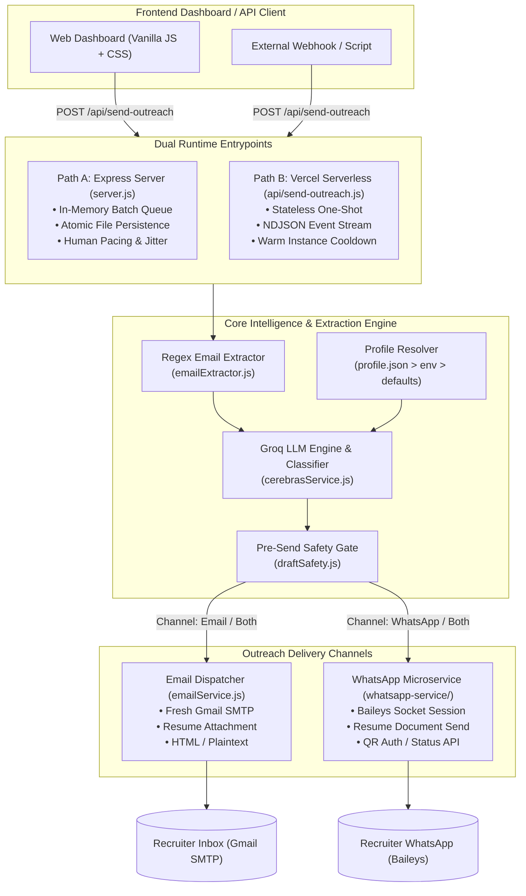

# ⚡ Job Mail & WhatsApp Automation

<div align="center">


<br />

**Autonomous, fact-grounded multichannel recruiter outreach bot powered by Groq LLMs, unpooled Gmail SMTP, and Baileys WhatsApp automation.**

[Key Highlights](#-key-highlights) • [Architecture](#-system-architecture) • [Dual Execution Paths](#-two-execution-paths) • [Quickstart](#-quickstart--setup) • [Configuration](#-configuration--environment-variables) • [API Reference](#-api-reference) • [Safety & Anti-Ban](#-safety-gates--anti-ban-measures)

</div>

---

## 🚀 Overview

**Job Mail & WhatsApp Automation** transforms raw LinkedIn hiring posts into personalized, high-converting recruiter outreach in seconds. Instead of generic mass-spamming or manual copy-pasting:

1. **Instant Extraction:** Ingests raw LinkedIn posts, automatically detecting direct and obfuscated recruiter emails (`[at]`, `(at)`, `[dot]`, spaced strings) or target phone numbers.
2. **Fact-Grounded LLM Drafting:** Leverages Groq's high-throughput LLM (`openai/gpt-oss-20b` or custom models) to classify the job (Tech, Sales, Support, Hybrid) and selectively pull matching facts from your structured profile.
3. **Strict Safety Gates:** Discards drafts containing hallucinated tokens, placeholder brackets (`[Company]`), eligibility mismatches, or missing subject lines before outreach triggers.
4. **Multichannel Delivery:** Delivers personalized emails via Gmail SMTP with your PDF resume attached, or transmits a personalized WhatsApp greeting + resume PDF on-demand through an authenticated Baileys WhatsApp session.

---

## ✨ Key Highlights

<table>
  <tr>
    <td width="50%">
      <h3>📧 Smart Email Pipeline</h3>
      <ul>
        <li><b>De-obfuscating Parser:</b> Catches <code>hr [at] company [dot] com</code>, spaced characters, and standard regex formats.</li>
        <li><b>Dynamic Fact Mapping:</b> Matches job domain with your custom <code>techFacts</code>, <code>salesFacts</code>, or <code>customerCareFacts</code>.</li>
        <li><b>Unpooled Nodemailer:</b> Dedicated, fresh SMTP handshakes to prevent stale connection hang-ups on Gmail.</li>
        <li><b>Dry-Run Auditing:</b> Test your prompts and view output drafts saved to JSON without firing actual emails.</li>
      </ul>
    </td>
    <td width="50%">
      <h3>💬 WhatsApp Microservice</h3>
      <ul>
        <li><b>Baileys Socket Integration:</b> Robust WebSocket-based WhatsApp Web protocol with persistent auth credentials.</li>
        <li><b>Direct QR Onboarding:</b> Terminal and HTTP-streamed QR pairing via <code>/whatsapp/qr</code>.</li>
        <li><b>Document Transmission:</b> Automatically uploads and pairs candidate PDF resumes with the initial message.</li>
        <li><b>Humanized On-Demand Send:</b> Zero artificial queue delays during targeted 1-on-1 recruiter outreach sessions.</li>
      </ul>
    </td>
  </tr>
  <tr>
    <td width="50%">
      <h3>🛡️ Autonomous Safety & Integrity</h3>
      <ul>
        <li><b>Eligibility Guard:</b> If a post requires protected criteria or specific credentials not met in your profile, outreach skips gracefully.</li>
        <li><b>Placeholder Interceptor:</b> Never send embarrassing <code>[Hiring Manager Name]</code> or <code>[Company]</code> placeholders.</li>
        <li><b>Groq Token Rate Limiter:</b> Sliding-window RPM & TPM tracker customized for Groq free/tier budgets.</li>
      </ul>
    </td>
    <td width="50%">
      <h3>⚡ Resilient Architecture</h3>
      <ul>
        <li><b>Dual Runtime:</b> Run on persistent Node servers (Express with atomic JSON state) or serverless edge (Vercel NDJSON stream).</li>
        <li><b>Crash-Resilient State:</b> In-memory queue state is persisted atomically via temporary file writes & renames.</li>
        <li><b>Live Web Dashboard:</b> Responsive glassmorphic frontend with real-time SSE / NDJSON execution feedback.</li>
      </ul>
    </td>
  </tr>
</table>

---

## 🏗️ System Architecture



---

## ⚖️ Two Execution Paths

Choose the execution model that fits your infrastructure:

| Feature | Path A: Express Server (`server.js`) | Path B: Serverless Function (`api/send-outreach.js`) |
| :--- | :--- | :--- |
| **Ideal Environment** | Long-running servers (VPS, Docker, Render, Railway, Fly.io, Localhost) | Cloudflare, AWS Lambda, Vercel Serverless |
| **State Management** | In-memory job queue persisted atomically to `data/queue-state.json` | 100% Stateless — single invocation per outreach |
| **Pacing Strategy** | Batched groups (`BATCH_SIZE`) with large batch delays + randomized jitter | Strict server-enforced cooldown (`POST_SEND_COOLDOWN_MS`) |
| **Progress Reporting** | Pollable state transitions via `GET /api/status/:jobId` | Real-time NDJSON stream (`queued → drafting → drafted → sending → sent`) |
| **Queue Resilience** | Restores unprocessed and active jobs automatically after unexpected restarts | Not applicable (lifecycle ends when HTTP response finishes) |

---

## 📂 Project Structure

```bash
Job-mail-Automation/
├── server.js                     # Main Express server: queue, batching, state machine, API routes
├── api/
│   └── send-outreach.js          # Stateless Vercel serverless streaming handler (Path B)
├── config/
│   └── profile.js                # Profile manager (profile.json > process.env > defaults)
├── services/
│   ├── cerebrasService.js        # Groq LLM integration, prompt engineering, role classifier
│   ├── emailService.js           # Nodemailer transport, unpooled Gmail SMTP, HTML rendering
│   ├── emailExtractor.js         # Extraction regex for plain, obfuscated, and spaced emails
│   ├── draftSafety.js            # Pre-send validation (placeholders, length, eligibility)
│   ├── groqRateLimiter.js        # Sliding-window RPM/TPM limiter for Groq APIs
│   └── whatsappService.js       # Main app client & proxy for WhatsApp microservice
├── persistence/
│   └── store.js                  # Atomic JSON store (temp write + rename) for queue state
├── public/                       # Frontend web dashboard
│   ├── index.html                # Modern UI with outreach input & channel toggles
│   ├── styles.css                # Glassmorphic responsive styling
│   └── script.js                 # Stream reader, status poller, and QR preview logic
├── resume/
│   └── resume.pdf                # Candidate PDF resume (attached to emails and WhatsApp)
├── data/                         # Local persistence (gitignored queue state & dry-run logs)
├── profile.example.json          # Starter template for candidate background & facts
├── whatsapp-service/             # Dedicated WhatsApp microservice
│   ├── server.js                 # Express server with Baileys socket integration
│   ├── services/
│   │   ├── whatsappClient.js     # Baileys connection handler, QR generator, message dispatcher
│   │   └── whatsappPolicy.js     # Phone validator & default greeting templates
│   ├── persistence/              # Local storage for sent contacts and Baileys session keys
│   └── package.json              # Microservice dependencies
├── test/                         # Native Node.js test suite
├── vercel.json                   # Vercel serverless runtime configuration
└── package.json                  # Root project manifest (ES Modules)
```

---

## 🚀 Quickstart & Setup

### 1. Prerequisites
- **Node.js**: v18.0.0 or higher
- **Gmail Account**: With [2-Step Verification](https://myaccount.google.com/signinoptions/two-step-verification) enabled
- **Groq Cloud Account**: For ultra-fast inference ([console.groq.com](https://console.groq.com))
- **WhatsApp Account**: On a secondary or active phone for pairing

### 2. Clone & Install
```bash
# Clone the repository
git clone https://github.com/Jashan-randhawa/Job-mail-Automation.git
cd Job-mail-Automation

# Install root dependencies
npm install

# Install WhatsApp microservice dependencies
cd whatsapp-service
npm install
cd ..
```

### 3. Add Candidate Resume
Drop your resume PDF into `resume/resume.pdf` (or customize the path with `RESUME_PATH`).

### 4. Configure Your Profile
Copy the example profile template:
```bash
cp profile.example.json profile.json
```
Edit `profile.json` to reflect your genuine experience, achievements, and facts:
```json
{
  "name": "Alex Doe",
  "phone": "+1 555 123 4567",
  "email": "alex.doe@example.com",
  "portfolioLink": "alexdoe.dev",
  "githubLink": "github.com/alexdoe",
  "linkedinLink": "linkedin.com/in/alexdoe",
  "degree": "B.S. Computer Science",
  "graduationYear": "2025",
  "availability": "immediately",
  "techFacts": "Extensive experience with TypeScript, React, Node.js, and Distributed Systems...",
  "salesFacts": "Track record of enterprise B2B sales development...",
  "customerCareFacts": "High CSAT support experience in fast-paced SaaS..."
}
```

### 5. Configure Environment Variables
Create `.env` files in both the project root and in `whatsapp-service/`:

**Root `.env` (`Job-mail-Automation/.env`):**
```env
# Groq API Configuration
GROQ_API_KEY=gsk_your_groq_api_key_here
GROQ_MODEL=openai/gpt-oss-20b

# Gmail SMTP Configuration
EMAIL_USER=your.email@gmail.com
EMAIL_APP_PASSWORD=your_16_char_app_password

# WhatsApp Microservice Connection
WHATSAPP_SERVICE_URL=http://localhost:4000
WHATSAPP_API_KEY=super_secure_shared_secret_123

# General Configuration
PORT=3000
DRY_RUN=0
```

**WhatsApp Service `.env` (`Job-mail-Automation/whatsapp-service/.env`):**
```env
PORT=4000
WHATSAPP_API_KEY=super_secure_shared_secret_123
```

> **How to get a Gmail App Password:**
> 1. Go to your [Google Account Security](https://myaccount.google.com/security) settings.
> 2. Ensure **2-Step Verification** is turned on.
> 3. Search for **App passwords** or visit [myaccount.google.com/apppasswords](https://myaccount.google.com/apppasswords).
> 4. Create an entry called "Job Automation Bot" and copy the 16-character token into `EMAIL_APP_PASSWORD`.

---

## 🏃 Running the Application

### Option A: Local Full Stack (Express + WhatsApp)
Open two terminal windows:

**Terminal 1 — WhatsApp Microservice:**
```bash
cd whatsapp-service
npm start
```
*On initial startup, check the console or visit `http://localhost:4000/whatsapp/qr` to pair your device.*

**Terminal 2 — Main Web Server:**
```bash
npm run dev
```
Open **`http://localhost:3000`** in your browser to access the dashboard.

---

### Option B: Deploy to Vercel (Email Channel Only)
Deploy the root repository directly to Vercel:
[](https://vercel.com/new)
Configure `GROQ_API_KEY`, `EMAIL_USER`, and `EMAIL_APP_PASSWORD` in your Vercel Project Environment Variables.

---

## ⚙️ Configuration & Environment Variables

### Root Application (`server.js` & `api/send-outreach.js`)

| Variable | Type | Default | Description |
| :--- | :---: | :---: | :--- |
| `GROQ_API_KEY` | `string` | **Required** | Groq Cloud API authentication key |
| `EMAIL_USER` | `string` | **Required** | Gmail address used for sending applications |
| `EMAIL_APP_PASSWORD` | `string` | **Required** | 16-character Google App Password |
| `GROQ_MODEL` | `string` | `openai/gpt-oss-20b` | Groq LLM model identifier |
| `GROQ_RPM_LIMIT` | `number` | `30` | Requests per minute budget |
| `GROQ_TPM_LIMIT` | `number` | `6000` | Tokens per minute budget |
| `PORT` | `number` | `3000` | Local HTTP port for Express |
| `RESUME_PATH` | `string` | `./resume/resume.pdf` | Absolute or relative path to PDF resume |
| `REPLY_TO_EMAIL` | `string` | `EMAIL_USER` | Optional alternative reply-to email |
| `DRY_RUN` | `boolean` | `0` | If `1`, writes drafts to disk instead of sending |
| `BATCH_SIZE` | `number` | `3` | Number of jobs per dispatch batch (Path A) |
| `BATCH_DELAY_MS` | `number` | `2700000` (45m) | Delay between outgoing batches |
| `MIN_SEND_INTERVAL_MS` | `number` | `45000` (45s) | Minimum pacing delay between individual sends |
| `SEND_JITTER_MAX_MS` | `number` | `20000` (20s) | Max random jitter added to send intervals |
| `WHATSAPP_SERVICE_URL` | `string` | `http://localhost:4000` | URL of the running WhatsApp microservice |
| `WHATSAPP_API_KEY` | `string` | `""` | Shared security secret for microservice calls |

### WhatsApp Microservice (`whatsapp-service/`)

| Variable | Type | Default | Description |
| :--- | :---: | :---: | :--- |
| `PORT` | `number` | `4000` | Microservice server port |
| `WHATSAPP_API_KEY` | `string` | **Required** | Header `x-api-key` required for all endpoints |
| `WHATSAPP_PERSIST_PATH` | `string` | `data/sent-contacts.json` | Path to log of contacted numbers |

---

## 📡 API Reference

### 1. Outreach Dispatch
```http
POST /api/send-outreach
```
**Request Body:**
```json
{
  "postText": "We are looking for a Full Stack Developer! Reach out to us at hiring@techcorp.io or +1234567890",
  "recipientEmail": "hiring@techcorp.io",
  "recipientPhone": "+1234567890",
  "channel": "both"
}
```
*Channels: `"email"` (default), `"whatsapp"`, or `"both"`.*

**Response (HTTP 202 Accepted):**
```json
{
  "jobId": "9b1deb4d-3b7d-4bad-9bdd-2b0d7b3dcb6d",
  "status": "queued",
  "position": 1,
  "etaSeconds": 45,
  "recipientEmail": "hiring@techcorp.io",
  "emailAutoDetected": false
}
```

---

### 2. Job Queue & Status

| Method | Endpoint | Description |
| :--- | :--- | :--- |
| `GET` | `/api/status/:jobId` | Retrieve full job state, draft details, timestamps, and error logs |
| `GET` | `/api/jobs` | List recent jobs and their current execution statuses |
| `POST` | `/api/jobs/:jobId/retry` | Re-enqueue a failed or rejected job |

#### Job State Lifecycle:
```
queued ──► processing ──► drafting ──► waiting ──► sending ──► sent
   │            │            │            │           │
   ▼            ▼            ▼            ▼           ▼
rejected   draft_failed  draft_failed  send_failed  send_failed / send_unknown
```

---

### 3. WhatsApp Proxy Endpoints

| Method | Endpoint | Description |
| :--- | :--- | :--- |
| `GET` | `/api/whatsapp/status` | Microservice connectivity status and total message count |
| `GET` | `/api/whatsapp/qr` | Get current base64 QR code for mobile pairing |

---

## 🛡️ Safety Gates & Anti-Ban Measures

Mass automated messaging violates carrier and platform terms of service. This project employs strict structural safeguards:

### WhatsApp Compliance
- **On-Demand Single Dispatches:** Designed for active 1-on-1 recruiter outreach sessions (~1 hour/day), avoiding unattended spam bots.
- **Fixed Polite Greeting:** Outreach messages avoid manipulative or deceptive clickbait language.
- **Direct PDF Attaching:** Transmits the resume document cleanly rather than sending spammy external file links.
- **Duplicate Prevention:** Tracks messaged numbers in `sent-contacts.json` to prevent accidental multi-messaging.

### Email Deliverability
- **Humanized Jitter & Pacing:** Inter-send delays of 45-65s and inter-batch pauses of 45+ minutes keep send volumes well under Google SMTP thresholds.
- **Unpooled Connections:** Ensures every email creates a clean TLS handshake, eliminating connection reuse timeouts.
- **Pre-Send Draft Validation:** Blocks empty drafts, excessive brevity (<80 characters), or leftover template brackets (`[Your Name]`, `[Company]`).

---

## 🧪 Testing

Run the comprehensive unit and integration test suite via Node's native test runner:

```bash
npm test
```

Covers:
- `test/cerebrasService.test.js`: Prompt generation, fact selection, and Groq JSON parsing.
- `test/emailExtractor.test.js`: Obfuscated email syntax (`[at]`, `[dot]`, spacing, invalid patterns).
- `test/groqRateLimiter.test.js`: Window sliding and rate pacing limits.
- `test/queueStateMachine.test.js`: Transition guarantees, state persistence, and error recovery.

---

## 📄 License

This project is open source and available under the [ISC License](package.json).

---

<div align="center">
  <sub>Developed with precision by <a href="https://github.com/Jashan-randhawa">Jashanpreet Singh</a></sub>
</div>

